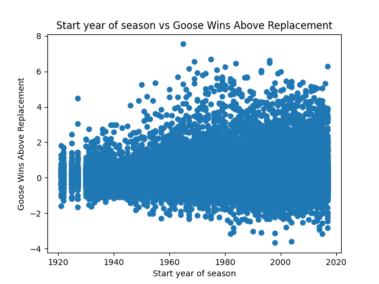

Describe:
|       |       year |   goose_eggs |   broken_eggs |        mehs |   league_average_gpct |         ppf |   replacement_gpct |          gwar |
|:------|-----------:|-------------:|--------------:|------------:|----------------------:|------------:|-------------------:|--------------:|
| count | 30962      |  30962       |   30962       | 30962       |         30962         | 30962       |      30962         | 20929         |
| mean  |  1981.14   |      5.52929 |       1.79068 |     1.49412 |             0.753962  |   100.282   |          0.718962  |     0.198106  |
| std   |    25.7185 |      9.42918 |       2.64371 |     2.47636 |             0.0222364 |     4.79258 |          0.0222364 |     0.954528  |
| min   |  1921      |      0       |       0       |     0       |             0.661454  |    88       |          0.626454  |    -3.67363   |
| 25%   |  1962      |      0       |       0       |     0       |             0.739127  |    97       |          0.704127  |    -0.366174  |
| 50%   |  1986      |      1       |       1       |     0       |             0.755009  |   100       |          0.720009  |     0.0952666 |
| 75%   |  2003      |      6       |       2       |     2       |             0.768881  |   103       |          0.733881  |     0.462547  |
| max   |  2017      |     82       |      22       |    23       |             0.821815  |   129       |          0.786815  |     7.54336   |

